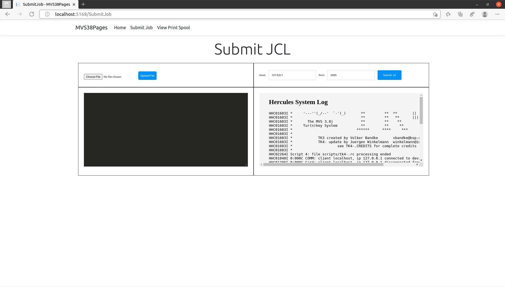
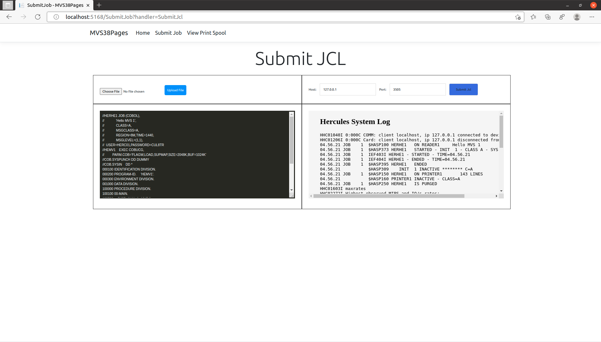
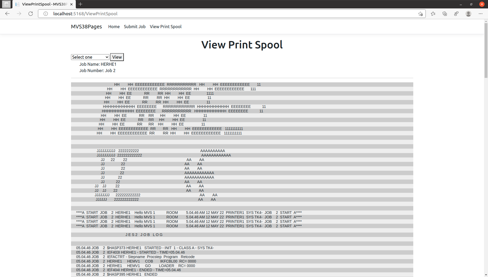

# Setting up a Print Queue on MVS 3.8j tk4 running on the Hercules mainframe emulator

 **Hercules** is an open source software implementation of the mainframe System/370 and ESA/390 architectures, in addition to the latest 64-bit z/Architecture. Hercules runs under Linux, Windows, Solaris, FreeBSD, and Mac OS X.

Hercules emulates the hardware now you need a operating system to run on top of it. That operating system is MVS 3.8j tk4. The following is from the [user’s manual:](http://wotho.ethz.ch/tk4-/MVS_TK4-_v1.00_Users_Manual.pdf)

> MVS 3.8j Tur(n)key 4- (“TK4-”) is a ready to use OS/VS2 MVS 3.8j system built specifically to run under the Hercules System/370, ESA/390, and z/Architecture Emulator. It is an extension of the original MVS T
>
> 

## Install MVS 3.8 j

You will need to install a copy of MVS 3.8 j on your Linux distro (instructions are for Ubuntu)

```bash
wget http://wotho.ethz.ch/tk4-/tk4-_v1.00_current.zip
unzip tk4-_v1.00_current.zip -d mvs38
cd mvs38/unattended
./set_console_mode
```

These commands get the latest version of MVS 3.8 and set it to run in console mode.

## Printer Queue Setup

Next, I have created a print queue setup tool so that output from the mvs printer will be placed in text files. (Code thanks to Tim Pinkawa (http://www.timpinkawa.net/hercules)). The setup tool’s source can be found at the git found above.

Make sure you are in your mvs38 directory and run the following which will setup the print queue and start mvs:

```bash
mvs38$ wget https://github.com/GroupTheorist12/MVSWarehouse/raw/main/utilities/printqueue_setup.zip
mvs38$ unzip printqueue_setup.zip
mvs38$ ./printqueue_setup
mvs38$ ./mvs
```

This fetches the printer queue setup utility from this git. (The rust source code is also found on this git)

After a few minutes you should see the following screen and were ready to go!


## Git Clone Web App for Submitting and Viewing Jobs

This git contains the .NET web app source for job submitting and viewing the print queue.

```bash
$ git clone https://github.com/GroupTheorist12/MVSWarehouse.git
$ cd MVSWarehouse/MVS38Pages
$ dotnet run
info: Microsoft.Hosting.Lifetime[14]
      Now listening on: http://localhost:5168

```

After running dotnet run, the dotnet cli will build the project, and run a web server running on a local port. (your port may be different than above)

Open a web browser and go to the web address and click on the Submit Job tab:



An example jcl file is in the MVS38Pages directory. Click the choose file button and navigate to the MVS38Pages directory, choose hello.jcl then click the ‘Upload File’ button.

In the right pane, click on the submit jcl button. This will submit the job to MVS.



Click on the View Print Spool tab to view the output of the job:



